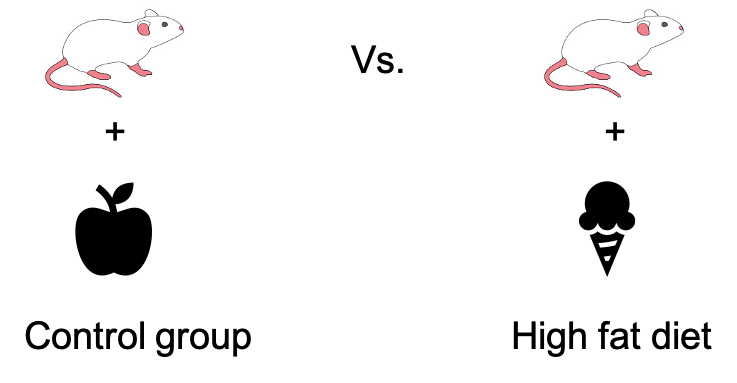

:::::::::::::::::::::::::::::::::::::: questions 

- What is a hypothesis test used for? 
- What are the general steps of a hypothesis test?

::::::::::::::::::::::::::::::::::::::::::::::::

::::::::::::::::::::::::::::::::::::: objectives

- Introduce an example scenario for hypothesis testing. 
- Describe null and alternative hypothesis.

::::::::::::::::::::::::::::::::::::::::::::::::

### An example  

What is a hypothesis test, and why do we need it? Consider the following example:

{width="500px" alt="mice with different diets"}

Researchers want to show that mice that are fed with a special “high fat” diet, grow to a different weight than mice that live on a normal, control diet.
They feed a group of mice with the control diet, and another group of mice with the high fat diet. After a couple of weeks, they measure the weight.

{width="600px" alt="Graph with mice weight measurements"}

The above graph shows you a subset of a real data set from [this paper](https://pubmed.ncbi.nlm.nih.gov/15561913/).
You see the individual control mice on the left, and the high fat mice on the right. The boxes that are overlaid indicate the median weights of both groups. 
The **scientific question** is whether the high fat diet has an impact on the weight. And phrased in a quantitative manner, we can ask whether there is a difference in weight between the mice from the two different groups. 
On the graph we certainly see a difference in means, but the problem is, of course, that **this difference could be due to chance**. Because we only have a sample of mice for each diet, and there is obviously some variation in the mouse weights. 
The good news is: If we know the rules for this variation, we can calculate how likely it is to see this difference by chance -- which is exactly what a statistical test does.

### A statistical model

When testing, we assume a statistical model for the data, for example we say that the weight of the individual mice is the composed of the diet effect (in this case the group means), plus something called residuals, which describe the effect of variation, and which follow a some distribution. If we measure mice weights, we will most likely assume that the residuals follow a Gaussian distribution, that means the weights show a bell shaped distribution around the group means.

### Null and alternative model

Actually, it’s not only one model, but two: The null model, and the alternative model, which describe the null and the alternative hypothesis.

Table: Null and alternative model 

| Hypothesis | Description | Corresponding model |
| --------- | ----------------- | --------------- |
| Null hypothesis (H0) | There is no difference between the two diet groups. | $\text{weight} = \text{grand mean} + \text{residuals}$ |
| Alternative hypothesis (H1) | There is a difference between the two diet groups. | $\text{weight} = \text{group means} + \text{residuals}$ |

We start by assuming that there is nothing to see in the data. This is called the null hypothesis. In this case, the null hypothesis is that there is no difference between the two groups of mice. This is described by the **null model**, where the data are sufficiently described by an overall average weight (not distinguishing between diets) and individual differences, called residuals.
We reject the null hypothesis when – assuming it was true – it would be very unlikely to observe a difference as extreme as in our data just by chance.  
In this case, we accept the alternative hypothesis – that there is a difference in weights. This hypothesis is described by an **alternative model**, which includes the diet as a variable.
So in summary, we use quantitative models to be able to calculate the probability of our data under the hypothesis that we want to test.

### Steps of hypothesis testing

Let's recapitulate what happens during hypothesis testing. Ideally, you undertake the following steps:  

1. Set up a null model or null hypothesis  
2. Collect data  
3. Calculate the probability of the data in the null model  
4. Decide: Reject the null model if the above probability is too small. 
