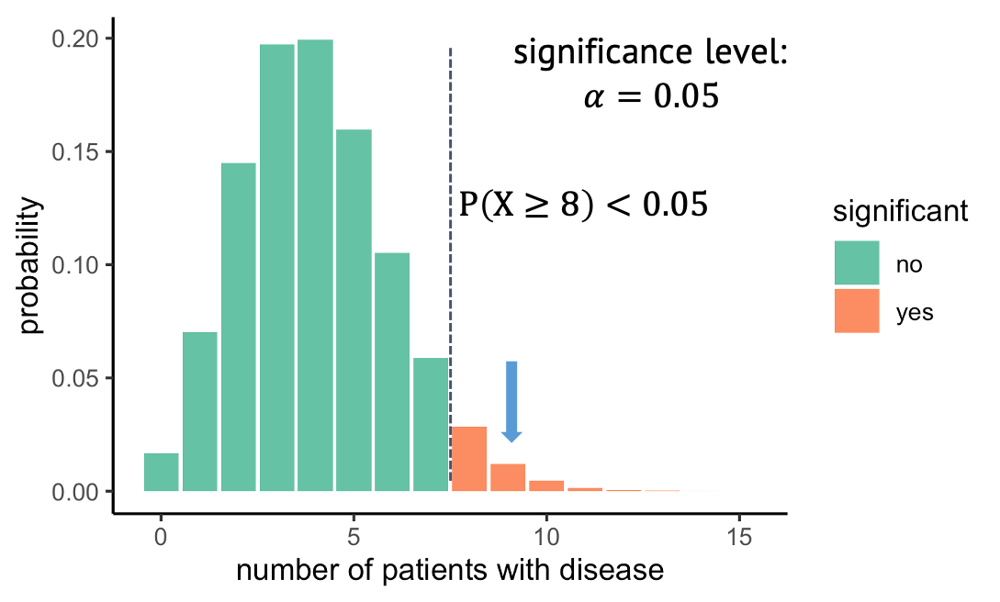

:::::::::::::::::::::::::::::::::::::: questions 

- Why is it important to define the hypothesis *before* running the test? 
- What is the difference between one-sided and two-sided tests?

::::::::::::::::::::::::::::::::::::::::::::::::

::::::::::::::::::::::::::::::::::::: objectives

- Explain the difference between one-sided and two-sided tests
- Raise awareness of data snooping / HARKing 
- Introduce further arguments in the `binom.test` function

::::::::::::::::::::::::::::::::::::::::::::::::
 

## A one-sided test

{width="500px" alt="Binomial null distribution with one-sided significance indicated."}

What you've seen in the last episode was a **one-sided test**, which means we looked at only at one side of the distribution. In this example, we observed 9 out of 100 persons with disease, then we asked: What is the probability under the null, to observe at least 9 persons with that disease. And we rejected all the outcomes where this probability was lower than 5%. The alternative hypothesis that we then take on is that the prevalence is larger than 4%.
But we could just as well have looked in the other direction and have asked: What is the probability of seeing at most the observed number of diseased under the null, and then in case of rejecting the null, we'd have accept the alternative hypothesis that the prevalence is below 4%.

Let me remind you how we initially phrased the research question and the alternative hypothesis: We wanted to test whether the prevalence is different from 4%. Well, different can be smaller or larger. So, to be fair, this is what we should actually do:

{width="500px" alt="Binomial null distribution with two-sided significance indicated."}
We should look on both sides of the distribution and ask what outcomes are unlikely. For this, we split the 5% significance to 2.5% on each side. That way, we will reject everything below 1, or above 8. 
The alternative hypothesis is now that the prevalence is different from 4%. 

But what exactly was wrong with a one-sided test? An observation of 9 is clearly higher than the expected 4, so no need to test on the other side, right? Unfortunately: no.

### Excursion: Data snooping / HARKing

What we did is called **HARKing**, which stands for “hypothesis after results known”, or, also data snooping.  
The problem is, we decided on the direction to look at after having seen at the data, and **this messes with the significance level $\alpha$**. The 5% is just not true anymore, because we spent all the 5% on one side, and we cheated by looking into the data to decide which side we want to look at. 
But if the null were true, then there would be a (roughly) 50:50 chance that the test group gives you an outcome that is higher or lower than the expected value. So we’d have to double the alpha, and in reality it would be around 10%. This means, assuming the null was true, we actually had an about 10% chance of falsely rejecting it.

:::::::::::::: callout
# Side note 

Above it says that there is a ~50% chance of the observation being below 4, and that a one-sided test after looking into the data had a significance level of ~0.1. The numbers are approximate, because a binomial distribution has discrete numbers. This means that  

1. there's not actually an outcome where the probability of seeing an outcome as high as this or higher is *exactly* 5%.  
2. it's actually more likely to see an outcome below 4 ($p=0.43$), than seeing an outcome above ($p=0.37$). The numbers don't add up to 1, because there is also the option of observing exactly 4 ($p=0.2$).  

:::::::::::::::::::::::

::::::::::::::::: challenge

## Challenge: one-sided test

In which of these cases would a one-sided test be OK?

1. The trial was conducted to find out whether the disease prevalence is increased due to the precondition. In case of a significant outcome, persons with the preconditions would be monitored more carefully by their doctors.  
2. You want to find out whether new-born children already resemble their father. Study participants look at a photo of a baby, and two photos of adult men, one of which is the father. They have to guess which of them. The hypothesis is that new-borns resemble their fathers and the father is thus guessed >50% of the cases. There is no reason to believe that children resemble their fathers *less* than they resemble randomly chosen men.
3. When looking at the data (only 1 out of 100), it becomes clear that the prevalence is certainly not increased by the precondition. It might even *decrease* the risk. We thus test for that.  

:::::::::::::::: solution

In the first and second scenario, one-sided tests could be used. There are different opinions to how sparsely they should be used. For example, [Whitlock and Schluter](https://whitlockschluter.zoology.ubc.ca/) gave the second scenario as a potential use-case. They believe that a one-sided test should only be used if "the null hypothesis are inconceivable for any reason other than chance". They would likely argue against using a one-sided test in the first scenario, because what if the disease prevalence is decreased due to the precondition? Wouldn't we find this interesting as well?
::::::::::::::::::::::::
:::::::::::::::::::

