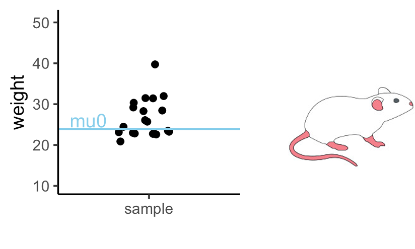
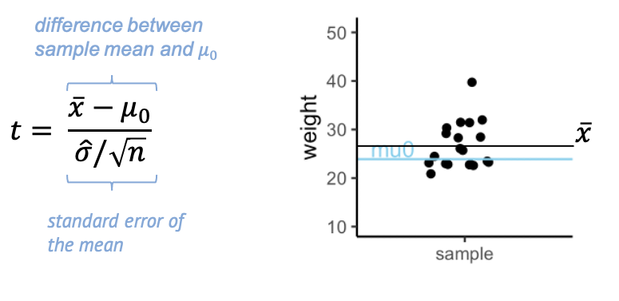
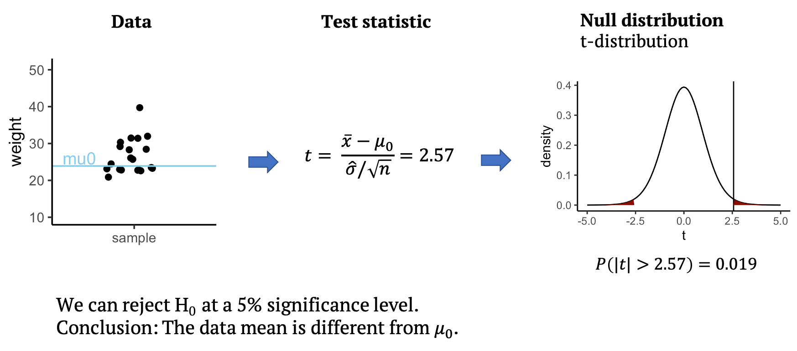

:::::::::::::::::::::::::::::::::::::: questions 

- What is a one-sample t-test?
- Why is $t$ a useful test statistic?

::::::::::::::::::::::::::::::::::::::::::::::::

::::::::::::::::::::::::::::::::::::: objectives

- Give an example for the one-sample t-test.
- Explain null and alternative hypothesis, and why we use test statistics.
- Explain that $t$ weighs sample size and effect size against variance.
::::::::::::::::::::::::::::::::::::::::::::::::


Let's get back to the mice example we saw in the beginning. We'll first simplify the example a bit: Let's suppose you measure the weight of a couple of mice that have been fed with high-fat diet (black dots). We now want to know whether the mice weights in the test group differ significantly from a known average mouse weight (blue line). 

{width="500px" alt="graph showing mouse weights of one sample, and a mean to compare them to."}

In the graph above you see one sample of 20 mice weights, from mice that had special diet, which average to $\bar{x}=26.6\,g$. We will compare their weights to a known average mouse weight $mu_0=23.9\,g$.
That means, we **compare a sample mean to $mu_0$**.


### Road map for the next three episodes

In this example, I will explain a t-test, one of the most commonly used tests. It is used for comparing two groups, or for comparing one group's average to a known average. I use the example to demonstrate the steps of performing a test that are valid for every test:  

- Set up the null hypothesis (and the alternative). In this case, that the mice in the test group (black dots) weigh on average the same as the known average weight (blue line).  
- Come up with a **test statistic**, that is, a number that summarizes the data points in a useful way. In the t-test, this statistic is called $t$.  
- Calculate value for the statistic ($t$) for the given data.  
- Calculate how likely it is to observe this value by chance, if the null hypothesis is true. For the t-test, this means calculating the probability of $t$ under the t-distribution. I will give you two explanations for why the t-distribution is a useful distribution for this example.  
- The calculated probability is the **p-value**, from which we can decide whether or not to reject the null hypothesis.  


### Null and alternative hypothesis

**Null hypothesis:** Mice fed with special diet are no different from other mice, and the observed difference between sample mean and mu0 was just by chance.  
**Alternative hypothesis**: The diet makes a difference, and the sampled mice come from a population where the average weight differs from $mu_0$.  

### The t-statistic 

In the previous example, we had measured one number, namely 9 persons with disease, of which we could calculate the probability under the null. 
This is not the case here: Here we have 20 numbers. Therefore, we have to help ourselves by summarizing these 20 numbers into something meaningful.

Here's what we calculate:

{width="600px" alt="Formula for t-statistic, and graph with moise weights indicating sample mean and mu0"}


The t- statistic is one value made out of the 20 values in the sample -- a scaled sample mean. 
In the numerator, we have the difference between $\bar{x}$, the sample mean, and $\mu_0$.
The denominator is the standard error of the mean (SEM), which is the sample standard deviation over the square root of the sample size.

Why is this a useful summary of the data? Because $t$ **summarizes how much evidence we have against the null hypothesis**. This means, $t$ is close to 0 if there is little evidence, and it becomes large when we have a lot of evidence.  


{width="600px" alt="Formula for t-statistic, and image of scale"}

In other words, we can say that **$t$ weighs effect size and sample size against the variance.** 


Evidence for a true difference between the weight of high-fat diet mice and $\mu_0$ increases (the absolute value of) $t$:  

- $\bar{x}-\mu_0$ is the observed difference between sample mean and $\mu_0$. If this difference is increased, then $t$ is increased also.  
- $\hat{\sigma}$ is the sample standard deviation (and in the denominator). If the sample has a high variance, this decreases the evidence -- and $t$.  
- $n$ is the sample size. Increasing $n$ also increases $t$, since more data points mean more evidence.  

Keep this picture in mind, because this weighing of effect size, sample size, and variance, is essentially what every test does, not only the t-test. It’s just the calculation, or the statistic used, that depends on the type of data.

### Performing the t-test

{width="800px" alt="Schema for performing a one-sample t-test"}

Back to our example: From the data, we can calculate the test statistic $t$, which in this case is $t=2.57$.
All that’s left to do is to look up whether a value as large as $2.57$ is surprising or not under the null distribution, which for the t-test is the t-distribution. 
The null distribution allows us to calculate how likely it is to observe a $t$ with an absolute value as large or larger than $2.57$, assuming that the data mean is $mu_0=23.9$. 
This probability under the null is $p=0.019$ for the given data. This means we can reject the null at a 5% significance level. We conclude that the data mean is different from $mu_0$, and that the mice on the special diet have a different weight from the known average.
In the next section, you will learn what the t-distribution is and why it is a good distribution for $t$.


::::::::::::::::: challenge

## Calculate t

Do the first step of your own t-test! Below, the values I used for the above graph are summarized in the `weights` vector.  


``` r
weights <- c(31.41, 28.29, 22.82, 26.07, 31.97, 22.60, 31.47, 29.18, 22.98, 23.26, 23.48, 20.88, 28.44, 30.34, 23.14, 22.80, 24.47, 39.73, 25.71, 22.74)
mu0 <- 23.89338
```

1. Calculate $t$
2. Add an outlier with a weight of $50$ to the `weights` vector. How does this affect $t$?

::::::::::::::::::::: solution

1. Calculate t:

``` r
tstat <- (mean(weights) - mu0) *sqrt(length(weights)) / sd(weights) 
tstat
```

``` output
[1] 2.567434
```

2. Add an outlier 

``` r
weights <- c(weights,50)
tstat <- (mean(weights) - mu0) *sqrt(length(weights)) / sd(weights) 
tstat
```

``` output
[1] 2.545858
```

::::::::::::::::::::::::::::
:::::::::::::::::::::::::::


