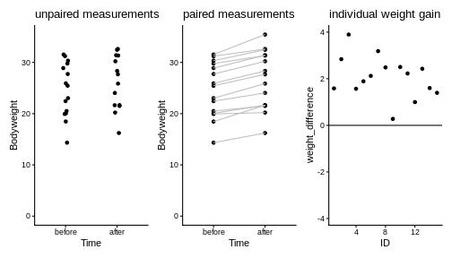

:::::::::::::::::::::::::::::::::::::: questions 

- How is the one-sample t-test extended to two samples?  
- What is pairing? 
- What is pairing good for?

::::::::::::::::::::::::::::::::::::::::::::::::

::::::::::::::::::::::::::::::::::::: objectives

- Introduce two-sample and paired t-test. 
- Introduce the concept of statistical power.

::::::::::::::::::::::::::::::::::::::::::::::::


## The two-sample t-test

So far, I explained the t-test using one sample that was compared to a known number. More commonly, two samples are compared. 
For example, in the scenario I depicted at the beginning of this tutorial, the sample of mice on high fat diet were compared to a group of mice fed with a control diet. 


The approach for testing stays the same. We still summarize the data into a statistic called $t$ and then calculate its probability under the null hypothesis. 

The only thing that changes is the formula for $t$. For two samples, it's  
$$t= \frac{\bar{x}-\bar{y}}{SE}$$ 
with 
$$SE= \sqrt{\frac{\hat{\sigma}_x^2+\hat{\sigma}_y^2}{n}}.$$

for equal variances and sample size. If $H_0$ is correct, $t$ follows a t-distribution with $n_x+n_y-2$ degrees of freedom.  

This means $t$ still compares effect size, sample size and variance. The effect size is now the difference between the two sample means.  

The formula gets more complicated when the assumptions of equal variances and sample sizes don't hold, which is often the case. But the good news is: You don't have to remember any of these formulae, nor the parameters of the null distribution. Any statistics program will do this for you. The important thing is that you know how to interpret the results.   


By the way, for the two samples comparing the diets, we get $t=-2.05$ and a p-value of $p=0.053$. For this sample, we can't reject the null hypothesis at a 5% significance level. Fortunately, the data for this example was only a small subset of the original data set. The researchers who performed the experiment had enough data points (and thus evidence) to [clearly demonstrate that the high-fat diet leads to heaver mice](https://doi.org/10.2337/diabetes.53.suppl_3.S215
).

## Pairing data 

Let’s assume the experiment had looked a little different: Let’s say there is only one group of mice, and each mouse in that group was measured, then fed with special diet for a month, and then measured again. For each mouse we have now two data points. This is visualized below:


We see a trend that after one month, the mice might be a bit heavier. The difference in means is $2.06\,g$, but due to the high variance, a non-paired two-sample t-test is not significant ($p=0.31$).


``` r
t.test(Bodyweight ~ Time, data=paired_mice, paired=FALSE)
```

``` error
Error in t.test.formula(Bodyweight ~ Time, data = paired_mice, paired = FALSE): cannot use 'paired' in formula method
```


However, this test completely neglects the information of which two data points come from the same mouse.
Therefore, let's consider another plot, where each two data points that belong to the same mouse are connected with a line. We say that these data points are *paired* by the mouse identity.





Now it seems clear that each mouse gained a small amount of weight, something that has been obscured before by the high variance of the individual mice weights.
In fact, we can also plot the individual weight differences only (right plot) to make the point that every single mouse has gained a small amount of weight.

The paired t-test is based on the individual difference between paired data points. It has the null hypothesis that these differences are zero. This brings the scenario down to a one-sample t-test: We look at the individual weight differences and test whether they are different from zero.
The estimated effect size, namely the weight difference, stays the same. But the p-value drops dramatically, as you can see in the below code:


``` r
t.test(Bodyweight ~ Time, data=paired_mice, paired=TRUE)
```

``` error
Error in t.test.formula(Bodyweight ~ Time, data = paired_mice, paired = TRUE): cannot use 'paired' in formula method
```

## Pairing increases power

Therefore we say that the paired t-test has an increased power compared to the unpaired two-sample t-test. 
Power describes the chance of detecting an effect with your test, if this effect exists. In this example, there is an effect (I can assure you, because I simulated the data). And the paired test detected it, while the unpaired didn’t. 
The reason is simple: There are two sources of randomness in the data:  

- The individual responses to the treatment and 
- mice have different weights to start with.  

In the paired design, we can control for the latter of these sources of noise.  


:::::::::::::::: challenge
# Diving seals

(This exercise is from Whitlock and Schluter (2015).)


Weddell Seals take long, exhausting dives to feed on fish. Researchers wanted to test whether the seals' exhaustion comes from diving alone, or whether feeding itself is also energetically expensive. They compared the oxygen consumption ($ml\,O_2/kg$) of feeding and non-feeding dives that lasted the same amount of time, in the same individual. 

The measurements of 10 individuals are summarized in the `oxygen_data` data frame as follows:


``` r
oxygen_data <- data.frame(
  type = c(rep("non-feeding",10),rep("feeding",10)),
  individual = as.character(c(1:10,1:10)),
  consumption = c(42.2,51.7,59.8,66.5,81.9,82.0,81.3,81.3,96.0,104.1,
                  71.0,77.3,82.6,96.1,106.6,112.8,121.2,126.4,127.5,143.1)
)
```


1. Copy the above lines of code and consider the `oxygen_data`. Can you plot the data to compare the oxygen consumption in a feeding and non-feeding dive?

2. Perform a paired t-test that compares feeding and non-feeding dives. You can either combine `filter`and `pull` to extract two vectors from the data frame, or use the `t.test` in conjunction with a formula.

:::::::::::::::::: solution

1. plotting the data

``` r
oxygen_data %>% 
  ggplot(aes(x=type, y=consumption)) +
  geom_point() +
  geom_line(aes(group=individual))
```

2. paired t-test


``` r
# extract two vectors and perform the test
feeding <- oxygen_data %>% 
  filter(type=="feeding") %>% 
  pull(consumption)
nonfeeding <- oxygen_data %>% 
  filter(type=="non-feeding") %>% 
  pull(consumption)

t.test(feeding,nonfeeding,
       paired=TRUE)
# OR
t.test(consumption~type, data=oxygen_data, paired=TRUE)
```

::::::::::::::::::::::::::
::::::::::::::::::::::::


