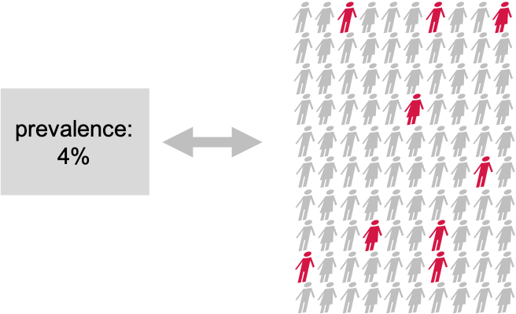
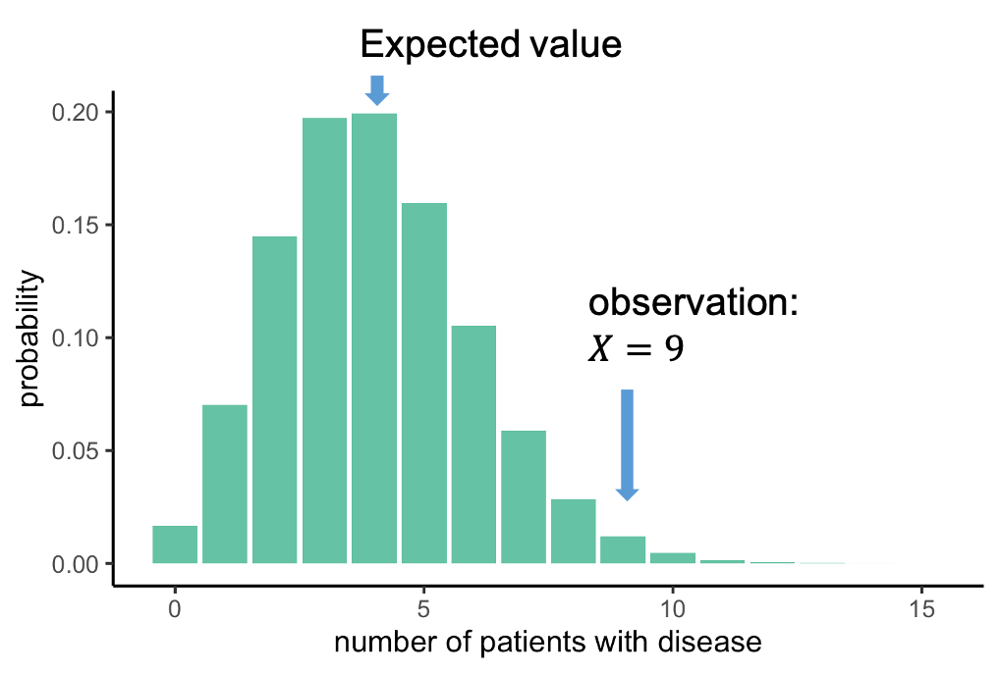

:::::::::::::::::::::::::::::::::::::: questions 

- What is the null distribution? 
- How can we use the null distribution to make a decision in hypothesis testing?  
- How can we run a hypothesis test in R?

::::::::::::::::::::::::::::::::::::::::::::::::

::::::::::::::::::::::::::::::::::::: objectives

- Give an example for a simple hypothesis test, including setting up the null and alternative hypothesis and the corresponding null model, and decision making.  
- Demonstrate how p-values can be calculated from either cumulative probabilities or the `.test` functions in R.

::::::::::::::::::::::::::::::::::::::::::::::::
 

Throughout the next episodes, we consider a research project where we want to find out whether the prevalence of a disease in a test group is different from the population average. We'll conduct a very simple test to answer that question.


{width="500px" alt=""}

Suppose There is a disease with a known prevalence of 4%. This means, 4% of the whole population have this disease. Now you are interested in whether a certain pre-condition, let’s say overweight, or living in a certain area, changes the risk of getting the disease. You take 100 persons with this precondition and you check the disease prevalence within the test group. 9 out of the 100 test persons have the disease. 

### Null and alternative hypothesis

This is how we can formalize the hypotheses: Our **null hypothesis** is the “boring” outcome. If there is nothing to see in the data, then the prevalence in the test group is also 4%, just as in the whole population. We want to collect evidence against this hypothesis.
If we have enough evidence against the null, we reject it, and accept the alternative hypothesis that the prevalence in the test group differs from 4%. 
This test is so easy, because the null model is simply the well-known binomial distribution with a sample size of 100 and a probability of 4%:

$$ H_O: X \sim Bin(N=100, p=0.04)$$

### The null distribution

We can look at this distribution:

{width="500px" alt="binomial probability distribution of number of patients with disease"}

It gives us the probabilities of seeing $X$ cases out of 100 with the disease, given that each individual has a probability of 4% of having this disease. This distribution peaks at 4 out of a 100, which makes sense: You expect to see around 4 out of a 100 when the probability is 4%.
We, on the other hand, observed 9 out of a 100. Now we can ask: How likely is it to see an event at least as extreme as 9 out of 100, assuming the null hypothesis, and thus the distribution above, is true. 
In this case, the probability of observing 9 or more persons with the disease is 0.019, this is rather unlikely, and we will conclude that the null hypothesis is likely false.


### Decision: Do we reject the null hypothesis?

At what probability should you decide to reject the null hypothesis? This choice is rather arbitrary. It depends on how sure you want to be that there is really something to see in the data set. **A wide-spread convention is to call the result significant if the probability under the null hypothesis is smaller than 5%.** We say that you choose a significance level alpha of $\alpha=5 \%$. 
In our example, with a significance level of 5%, all observations above 8 out of 100, shown in red, would be called significant.

{width="500px" alt="The null distribution of the number of patients with disease, with significant outcomes indicated by colour."}


### Recap  

Here is what we have just seen:   

- In a **test group** of persons with a precondition, 9 out of 100 have the disease of interest.  
- We compare to a **known prevalence** of 4%, that means 4% of the entire population have the disease, when not distinguishing between persons with and without the precondition.  
- We want to know whether the observed 9 out of 100 are significantly different from 4%. The **null hypothesis** thus is that they are *not*. 
- The **alternative hypothesis** is that the prevalence in the test group differs from 4%.  
- As we have 100 cases and a binary outcome (disease or no disease), a suitable **null model** is a binomial distribution with $n=100$ and success probability $p=0.04$.  


### Binomial test in R  

Programming languages such as Python or R have functions for calculating probabilities under different distributions. 

In our scenario, we want to calculate the probability of observing 9 or more persons with a disease out of 100, given a "null prevalence" of 4%.

Here is the result, calculated with R: 
```{r one-sided-test-example}
pbinom(q=8, size=100, prob=0.04, lower.tail=FALSE)
```

Don't worry about the syntax for now - we will explain it during the coding session. 

The result of this computation is our p-value: The probability of seeing 9 or more persons with a disease, assuming the null distribution represents a population where the incidence is 4%. 

:::::::::::::: discussion


Before we continue to the next episode, I have to tell you that something is very wrong (conceptionally) with the test we just performed.  


{width="300px" alt="A cup of coffee"}


      
... and think about what the *initial alternative hypothesis* was, and whether this is in line with what we calculated.  

(Image: Wikimedia)
:::::::::::::::::


