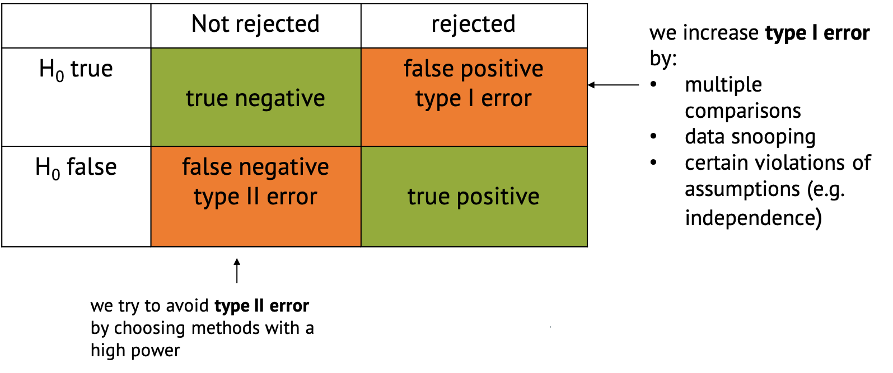

:::::::::::::::::::::::::::::::::::::: questions 

- What errors can occur in hypothesis testing?

::::::::::::::::::::::::::::::::::::::::::::::::

::::::::::::::::::::::::::::::::::::: objectives

- List the possible errors in hypothesis testing and give the reasons why they occur.

::::::::::::::::::::::::::::::::::::::::::::::::
 

We just learned about data snooping, or HARKing, which is one way of *p-hacking*, i.e. cheating to get significant results. Another example is method hacking, where you try different methods until one of them gives a significant result.  

You might have heard people say that p-hacking (or other things) *increase type I error*. Here's what this means:  

If you perform a test and either reject the null hypothesis or not, there are four possible outcomes:  

{width="600px" alt="image of confusion matrix"}

- The favorable classifications are **true negative**, where you correctly don't reject the null, and **true positive**, where you correctly reject it and decide that there is something interesting to see in your data.  
- There are also two ways in which the classification can go wrong. One is said **false positive**, also called **type I error**, where the null is incorrectly rejected. This just happens by chance in a certain percentage of cases. For example, per definition it happens in 5% of the cases when you choose a significance level of $\alpha=0.05$. But there are other things that can increase the chances for false positives, including p-hacking, multiple comparisons (which is part of the next tutorial), or certain violations of the assumptions (e.g. independence).  
- **False negative** classification or **type II** error describes the case when the null hypothesis isn't rejected even though something interesting is happening. This is likely to happen if we have too little data, or use methods that are not powerful enough to detect what we're looking for. We try to avoid type II error by choosing methods with a *high power*.  