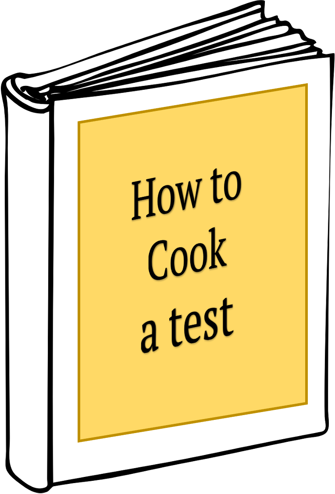

I hope this tutorial allowed you to notice a pattern in the tests you have seen.  

{width="150px" alt="Image of a cookbook for statistical tests"}

The "cook book" for a test goes as follows:  

1. Set up a **hypothesis $H_0$** that you want to reject.  

2. Find a **test statistic** that should be sensitive to deviations from $H_0$.  

3. Find the **null distribution** of the test statistic – the distribution that it follows under the null hypothesis.   

4. Compute the actual value of the test statistic.  

5. Compute the **p–value**: The probability of seeing a value as least as extreme as the computed value in the null distribution. 

6. Decide (based on significance level) whether to reject the null hypothesis.  

### Cook book in practice  

In practice, you usually don't have to perform steps 2-6 on your own -- standard procedures, i.e. statistical tests, exist for most kind of data, and the computer does the calculation for you. So... what is left for you to do?  

{width="300px" alt="Computer screen executing wilcoxon test"}

1. Look at your data!   

2. Decide on a distribution that your data follow.  

3. Possibly transform your data to match a suitable distribution (suitable means: a convenient test is available for this distribution).  

4. Find a test that answers your question and is suitable for the distribution the properties of your data.  

5. Perform the test and decide. Report the p-value *and* the effect size.  
